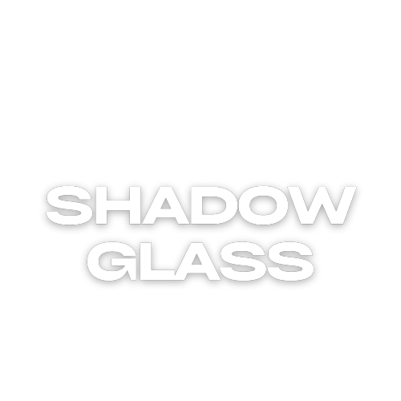

# ShadowGlass - Professional Window Tinting Website



## 🎯 Descripción del Proyecto

ShadowGlass es una página web profesional diseñada para un negocio de tintado de lunas de vehículos. La web está enfocada en convertir visitantes en clientes, transmitiendo elegancia, seriedad y confianza desde el primer vistazo.

### 🌟 Características Principales

- **Diseño Premium**: Interfaz moderna, elegante y minimalista
- **Totalmente Responsive**: Optimizada para móviles, tablets y desktop
- **Simulador de Tintado**: Herramienta interactiva para visualizar resultados
- **Galería Profesional**: Showcase de trabajos reales con filtros
- **Testimonios Dinámicos**: Slider con opiniones de clientes reales
- **Formulario de Contacto**: Sistema de citas con validación en tiempo real
- **Optimización SEO**: Estructura semántica y metadatos optimizados
- **Performance**: Carga rápida con lazy loading y optimizaciones

## 🚀 Tecnologías Utilizadas

### Frontend
- **HTML5**: Estructura semántica y accesible
- **CSS3**: Variables CSS, Grid, Flexbox, animaciones
- **JavaScript ES6+**: Modular, orientado a objetos, sin dependencias externas
- **Web APIs**: Intersection Observer, Local Storage, Fetch

### Tipografías
- **Inter**: Tipografía principal (sans-serif)
- **Playfair Display**: Títulos y elementos destacados (serif)

### Herramientas de Desarrollo
- **Live Server**: Desarrollo con hot reload
- **ESLint**: Linting de JavaScript
- **Prettier**: Formateo automático de código
- **HTML Validate**: Validación de HTML
- **Lighthouse**: Auditorías de performance y accesibilidad

## 📁 Estructura del Proyecto

```
shadowglass/
├── index.html              # Página principal
├── css/
│   └── style.css           # Estilos principales
├── js/
│   └── main.js             # JavaScript principal
├── assets/
│   ├── logo.svg            # Logo de ShadowGlass
│   ├── cars/               # Imágenes del simulador
│   ├── gallery/            # Galería de trabajos
│   ├── testimonials/       # Fotos de clientes
│   └── favicon.ico         # Favicon
├── package.json            # Configuración del proyecto
└── README.md               # Documentación

```

## 🛠️ Instalación y Uso

### Requisitos Previos
- Node.js 16+ (para herramientas de desarrollo)
- Navegador moderno con soporte ES6+

### Instalación

1. **Clonar el repositorio**
   ```bash
   git clone https://github.com/shadowglass/website.git
   cd shadowglass
   ```

2. **Instalar dependencias de desarrollo**
   ```bash
   npm install
   ```

3. **Iniciar servidor de desarrollo**
   ```bash
   npm run dev
   ```

4. **Abrir en el navegador**
   - La web se abrirá automáticamente en `http://localhost:3000`

### Scripts Disponibles

```bash
# Servidor de desarrollo con live reload
npm run dev

# Servidor HTTP simple
npm run start

# Validar HTML
npm run validate-html

# Linting de JavaScript
npm run lint

# Formatear código
npm run format

# Auditoría con Lighthouse
npm run lighthouse
```

## 🎨 Guía de Diseño

### Paleta de Colores

```css
--primary-color: #0a0a0a      /* Negro principal */
--secondary-color: #1a1a1a    /* Negro secundario */
--accent-color: #ffffff       /* Blanco/Acento */
--text-primary: #ffffff       /* Texto principal */
--text-secondary: #cccccc     /* Texto secundario */
--text-muted: #999999         /* Texto atenuado */
--border-color: #333333       /* Bordes */
```

### Tipografía

- **Títulos**: Playfair Display (serif, elegante)
- **Cuerpo**: Inter (sans-serif, legible)
- **Jerarquía**: h1-h6 con escalas fluidas (clamp)

### Espaciado

Sistema de espaciado consistente basado en múltiplos de 0.5rem:
- `--space-xs`: 0.5rem
- `--space-sm`: 1rem
- `--space-md`: 1.5rem
- `--space-lg`: 2rem
- `--space-xl`: 3rem

## 📱 Responsive Design

### Breakpoints

- **Mobile**: < 768px
- **Tablet**: 768px - 1024px
- **Desktop**: > 1024px

### Estrategia Mobile-First

El diseño está optimizado para móviles primero, escalando hacia dispositivos más grandes con media queries.

## ⚡ Optimizaciones de Performance

### Técnicas Implementadas

1. **Lazy Loading**: Imágenes cargadas bajo demanda
2. **Throttling**: Eventos de scroll optimizados
3. **CSS Optimizado**: Variables nativas, selectores eficientes
4. **JavaScript Modular**: Código organizado en clases
5. **Compresión**: Assets optimizados para web

### Métricas Objetivo

- **LCP (Largest Contentful Paint)**: < 2.5s
- **FID (First Input Delay)**: < 100ms
- **CLS (Cumulative Layout Shift)**: < 0.1
- **Lighthouse Score**: > 95

## 🔧 Funcionalidades

### Simulador de Tintado

- Selección de tipo de vehículo
- Niveles de tintado (20%, 35%, 50%)
- Colores de vehículo
- Cálculo automático de precios
- Visualización en tiempo real

### Galería Filtrable

- Sistema de filtros por categoría
- Modal para vista ampliada
- Transiciones suaves
- Lazy loading de imágenes

### Slider de Testimonios

- Auto-play con pausa en hover
- Controles táctiles (swipe)
- Indicadores visuales
- Responsive completo

### Formulario de Contacto

- Validación en tiempo real
- Estados de loading
- Notificaciones de éxito/error
- Campos específicos del negocio

## 🎯 SEO y Accesibilidad

### SEO

- Estructura semántica HTML5
- Meta tags optimizados
- Schema markup (próximamente)
- URLs amigables
- Sitemap XML (próximamente)

### Accesibilidad

- Contraste WCAG AA compliant
- Navegación por teclado
- Screen reader friendly
- Atributos ARIA apropiados
- Focus visible en elementos interactivos

## 📊 Analytics y Tracking

### Configuración Recomendada

- Google Analytics 4
- Google Tag Manager
- Hotjar para heatmaps
- Google Search Console

## 🚀 Despliegue

### Opciones de Hosting

1. **Netlify** (Recomendado)
   - Deploy automático desde Git
   - HTTPS gratuito
   - CDN global

2. **Vercel**
   - Excelente performance
   - Preview deployments

3. **GitHub Pages**
   - Gratuito para repositorios públicos
   - Integración directa con GitHub

### Configuración de Dominio

1. Registrar dominio personalizado
2. Configurar DNS records
3. Activar HTTPS
4. Configurar redirects (www → non-www)

## 🔐 Seguridad

### Mejores Prácticas

- Content Security Policy (CSP)
- HTTPS obligatorio
- Validación server-side del formulario
- Sanitización de inputs
- Rate limiting en formularios

## 📈 Monitorización

### Herramientas Recomendadas

- **Uptime Robot**: Monitoreo de disponibilidad
- **Google PageSpeed Insights**: Performance
- **GTmetrix**: Análisis detallado de carga
- **Lighthouse CI**: Auditorías automáticas

## 🤝 Contribución

### Workflow de Desarrollo

1. Fork del repositorio
2. Crear branch feature/bugfix
3. Commit con mensajes descriptivos
4. Testing en múltiples dispositivos
5. Pull request con descripción detallada

### Estándares de Código

- ESLint para JavaScript
- Prettier para formateo
- Comentarios en español
- Naming conventions consistentes

## 📞 Contacto y Soporte

### Equipo de Desarrollo

- **Lead Developer**: [Nombre]
- **UI/UX Designer**: [Nombre]
- **SEO Specialist**: [Nombre]

### Soporte

- **Email**: dev@shadowglass.es
- **Issues**: GitHub Issues
- **Documentación**: Wiki del proyecto

## 📄 Licencia

Este proyecto está bajo la licencia ISC. Ver el archivo `LICENSE` para más detalles.

## 🔄 Changelog

### v1.0.0 (2024-07-19)
- Lanzamiento inicial
- Diseño responsive completo
- Simulador de tintado funcional
- Galería con filtros
- Slider de testimonios
- Formulario de contacto
- Optimizaciones de performance

---

**ShadowGlass** - Tintado Profesional de Lunas | © 2024 Todos los derechos reservados.
